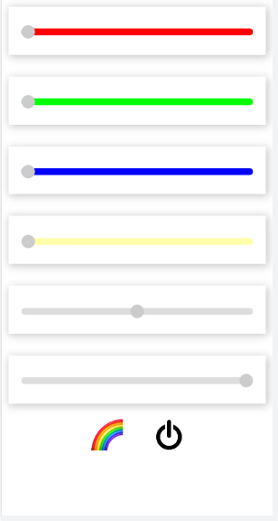

# neopixelServer
Neopixel led strip web control [ESP8266](https://github.com/esp8266/Arduino) based (Wemos D1 mini).

RGBW intensity, strip length and position control by sliders.
Special rainbow effect.

Two physical switches allow to turn on/off and control full color.
